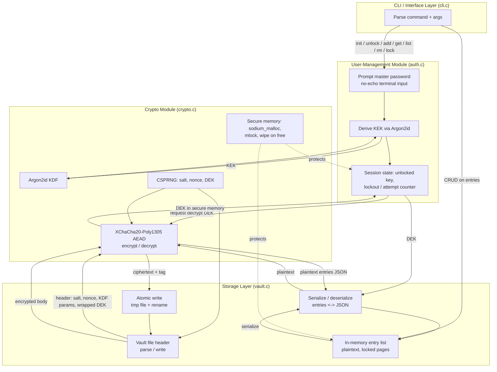

# Password Manager — Checkpoint 1: Threat Model & Architecture

## 1. Scope

A local, single-user command-line password manager written in C. It stores
credentials (title, username, password, URL, notes) in a single encrypted
vault file on disk. No network sync in this checkpoint — everything is
local-first. Cryptography is provided by **libsodium**; no hand-rolled
primitives.

## 2. Architecture

Three modules, plus a thin CLI layer that ties them together.



**Data flow, unlock path:**
`master password -> Argon2id(salt from vault header) -> KEK -> AEAD-decrypt
wrapped DEK from header -> DEK held in locked memory -> AEAD-decrypt vault
body with DEK -> JSON parsed into in-memory entry list.`

**Data flow, save path:**
`entry list -> serialize to JSON -> AEAD-encrypt with DEK (fresh nonce) ->
write ciphertext + tag + header to temp file -> fsync -> atomic rename over
vault file.`

### Module responsibilities

| Module | File(s) | Responsibility | Does *not* do |
|---|---|---|---|
| Crypto | `crypto.c/h` | KDF, AEAD encrypt/decrypt, CSPRNG, secure-memory alloc/wipe | Never touches the filesystem or CLI |
| User management | `auth.c/h` | Master password prompt, KEK derivation, session/unlock state, attempt limiting | Never encrypts vault entries directly — delegates to crypto module |
| Storage | `vault.c/h` | Vault file format, atomic read/write, header parsing, entry serialization | Never sees the plaintext master password |
| CLI | `cli.c/h`, `main.c` | Argument parsing, command dispatch, output formatting | Holds no long-lived secrets itself |

The boundary that matters: **plaintext passwords exist only inside the
crypto and storage modules' secure-memory buffers**, and only while the
vault is unlocked. The CLI layer passes opaque handles, not raw secrets,
wherever possible.

## 3. Threat Model

Assets: the master password, the derived keys, the vault file, and the
plaintext entries while the vault is unlocked in memory.

Out of scope for this checkpoint: multi-user sync, network transport,
malicious/compromised OS kernel, hardware keyloggers, and a fully
adversarial local root user (mitigations are noted where cheap, but a root
attacker on the same machine is not fully defensible with a CLI tool).

| # | Surface | Threat | Mitigation |
|---|---|---|---|
| T1 | Master password | Offline brute-force / dictionary attack against a stolen vault file | Argon2id KDF with tuned `opslimit`/`memlimit` (memory-hard, GPU/ASIC-resistant); unique random salt per vault |
| T2 | Master password | Shoulder surfing / terminal scrollback capturing the password | Disable terminal echo on input (`termios` raw mode); never pass the password as a CLI argument (visible in `ps`, shell history); never log it |
| T3 | Master password | Online brute-force against an unlocked session / repeated unlock attempts | Exponential backoff or attempt counter with delay after failed unlocks; no distinct error message that reveals *why* unlock failed (wrong password vs. corrupt file) beyond "unlock failed" |
| T4 | Master password | Password reuse / weak password chosen by user | Optional strength check on `init` (entropy estimate) with a warning, not a hard block (checkpoint scope: warn only) |
| T5 | Vault at rest | Vault file stolen (disk theft, backup, synced cloud folder) and read offline | AEAD (XChaCha20-Poly1305) gives confidentiality; ciphertext is useless without the KEK, which requires the master password + Argon2id work factor |
| T6 | Vault at rest | Vault file tampered with (bit-flip, truncation, swapped entries) | AEAD authentication tag is verified before any plaintext is trusted; decryption fails closed (aborts, no partial output) on tag mismatch |
| T7 | Vault at rest | Crash / power loss during save corrupts the vault | Atomic write: write to `vault.tmp`, `fsync`, `rename()` over the real file (rename is atomic on the same filesystem); previous vault is never truncated in place |
| T8 | Vault at rest | Loose file permissions let other local users read the vault | `chmod 600` on vault file creation; refuse to operate if permissions are unexpectedly loose (warn/reset) |
| T9 | Vault in memory | Plaintext entries or keys swapped to disk | `sodium_mlock` / `mlock` on buffers holding the DEK and decrypted entries to prevent them being paged to swap |
| T10 | Vault in memory | Secrets linger in memory after use and get exposed via a core dump or a later heap read | `sodium_malloc`/`sodium_free` (guard pages + `sodium_memzero` on free) for all secret buffers; disable core dumps for the process (`setrlimit(RLIMIT_CORE, 0)`) |
| T11 | Vault in memory | Another process on the same host reads process memory | Best-effort only at this layer: rely on OS process isolation; `mlock` keeps secrets from swap but cannot stop a privileged attacker — documented as an accepted residual risk |
| T12 | Interface (CLI) | Retrieved password echoed to a terminal that's shared/recorded/screen-shared | `get` command copies to clipboard by default instead of printing, with an auto-clear timer; printing to stdout requires an explicit `--show` flag |
| T13 | Interface (CLI) | Retrieved password left sitting in the system clipboard | Clipboard entry is overwritten (or cleared) automatically after a short timeout (e.g. 20s) |
| T14 | Interface (CLI) | Command injection / path traversal via entry fields or vault path argument | Treat all entry fields as opaque data (never shell out with them); validate/normalize the vault file path; no `system()`/`popen()` calls anywhere in the codebase |
| T15 | Interface (CLI) | Timing side-channel on password/tag comparison | Use constant-time comparison (`sodium_memcmp`) for any secret comparison; AEAD tag verification is handled by libsodium, which is already constant-time |

## 4. Initial Design Decisions

### 4.1 Cryptographic scheme

- **Library:** libsodium — audited, widely used, avoids implementing AEAD
  or Argon2id by hand.
- **Key derivation:** Argon2id (`crypto_pwhash`, algorithm
  `crypto_pwhash_ALG_ARGON2ID13`), starting at the `MODERATE` op/mem limits
  and tunable up once the CLI has a `--kdf-profile` flag. Argon2id is
  chosen over Argon2i/2d and over PBKDF2/bcrypt for its resistance to both
  GPU and side-channel attacks.
- **Symmetric encryption / integrity:** XChaCha20-Poly1305-IETF
  (`crypto_aead_xchacha20poly1305_ietf_*`). Chosen over AES-256-GCM because
  it doesn't depend on AES-NI for good performance/safety and its 24-byte
  nonce is large enough to generate randomly per encryption without a
  meaningful collision risk (avoids the nonce-management pitfalls of
  96-bit GCM nonces).
- **Randomness:** `randombytes_buf` (libsodium's CSPRNG) for all salts,
  nonces, and the vault's data-encryption key.

### 4.2 Key hierarchy (envelope encryption)

Rather than deriving a single key straight from the master password and
using it to encrypt entries directly, the vault uses **envelope
encryption**:

1. On `init`, generate a random 256-bit **Data Encryption Key (DEK)** —
   this key actually encrypts the vault entries.
2. Derive a **Key Encryption Key (KEK)** from the master password via
   Argon2id with a random salt.
3. Encrypt the DEK with the KEK (AEAD) and store the wrapped DEK in the
   vault header.

This means **changing the master password re-wraps one 32-byte key**
instead of re-encrypting the entire vault, and it cleanly separates "what
protects the vault" (DEK) from "what the user remembers" (master
password).

### 4.3 Vault file format (version 1)

Single file, binary header + encrypted body:

```
Offset  Field                 Size        Notes
------  --------------------  ----------  --------------------------------
0       Magic                 8 bytes     "PWMNVLT1"
8       Format version        1 byte      0x01
9       KDF id                1 byte      0x01 = Argon2id
10      KDF opslimit          8 bytes     uint64, little-endian
18      KDF memlimit          8 bytes     uint64, little-endian (bytes)
26      KDF salt              16 bytes    random, generated at init
42      Wrapped-DEK nonce     24 bytes    XChaCha20 nonce
66      Wrapped DEK           32+16 bytes DEK ciphertext + Poly1305 tag
114     Body nonce            24 bytes    XChaCha20 nonce for entries
138     Body ciphertext       variable    AEAD(entries JSON) + 16-byte tag
```

The entries themselves are a JSON array
(`[{id, title, username, password, url, notes, created_at, updated_at}, ...]`)
before encryption — plain, boring, and easy for a second person to
debug/extend later. JSON was chosen over a hand-rolled binary record format
for this checkpoint to keep the storage layer simple; it's re-evaluated
later if a compact/streaming format is needed.

Writes are always atomic: build the full new file content, write it to
`vault.db.tmp` in the same directory, `fsync`, then `rename()` over
`vault.db`.

### 4.4 Alternatives considered

- **Deriving the vault key directly from the password (no DEK/KEK split):**
  simpler, but makes password changes require re-encrypting the whole
  vault and couples "vault key rotation" to "password change." Rejected in
  favor of the envelope scheme above.
- **AES-256-GCM instead of XChaCha20-Poly1305:** viable and also fine, but
  XChaCha20's larger nonce space is safer for a design that generates
  nonces randomly rather than tracking a counter, which is a better fit
  for a simple CLI tool. Revisit only if a hardware-accelerated AES path
  becomes a measured bottleneck.
- **SQLite as the storage backend:** more structure and easier querying,
  but adds a dependency and its own file-format concerns; a single
  encrypted blob is simpler to reason about for a checkpoint-scale vault.
  May be revisited if the entry count/search requirements grow.
